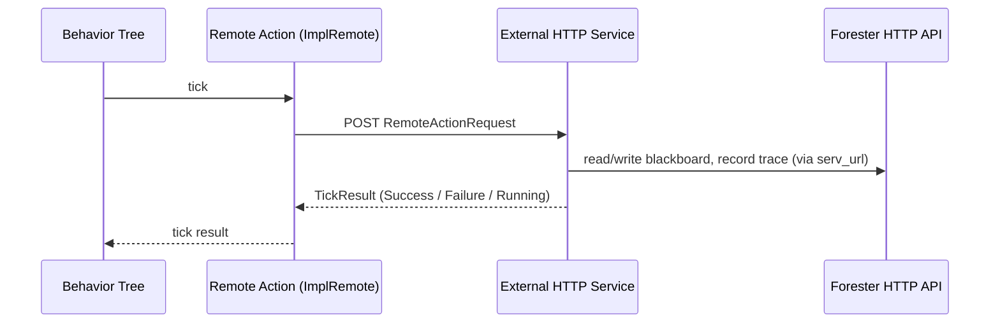

# Remote Actions

Remote actions let a behavior tree node delegate its work to an external HTTP service — for example a Python process running an LLM tool, or a separate microservice. Orchestration stays in the Rust engine while the actual work happens outside the process.

## Scheme



1. When the tree reaches a remote action, the engine `POST`s a `RemoteActionRequest` to the action's configured URL.
2. The external service performs the work and answers with a `TickResult` (`Success`, `Failure`, or `Running`).
3. While it runs, the service calls back to the **Forester HTTP API** at the `serv_url` to read/write the Blackboard and record tracer events.

## Request / Response

The engine sends the following request body:

```json
{
  "tick": 3,
  "args": [
    { "name": "arg", "value": 42 }
  ],
  "serv_url": "http://127.0.0.1:46123"
}
```

* `tick` — the current tick of the tree.
* `args` — the arguments passed to the action from the tree.
* `serv_url` — the URL of the Forester HTTP server (see [HTTP API](./http_api.md)).

The remote endpoint answers with a `TickResult`, one of `"Success"`, `"Running"`, or `{"Failure": "reason"}`.

## Background operations via the generated client

The remote action runs in the background against the Forester HTTP API. Instead of crafting the HTTP calls by hand, use a client generated from the OpenAPI specification (`GET /openapi.json`):

* **Rust** — `forester-http` provides `ForesterHttpClient`.
* **Python** — `forester-http-ra-py` provides `ForesterHttpClient`.

The client takes `serv_url` from the request and exposes typed helpers for the Blackboard and tracer:

```rust
let client = ForesterHttpClient::new(req.serv_url);
client.put("key", json!({ "f1": 1 })).await;      // write to the blackboard
client.get("key").await;                          // read from the blackboard
client.lock("key").await;                         // lock a blackboard entry
client.print_trace().await;                       // fetch the tracer
```

See the [HTTP API](./http_api.md) page for the full list of endpoints and the [forester-examples](https://github.com/besok/forester-examples) repository for complete Rust and Python implementations.
